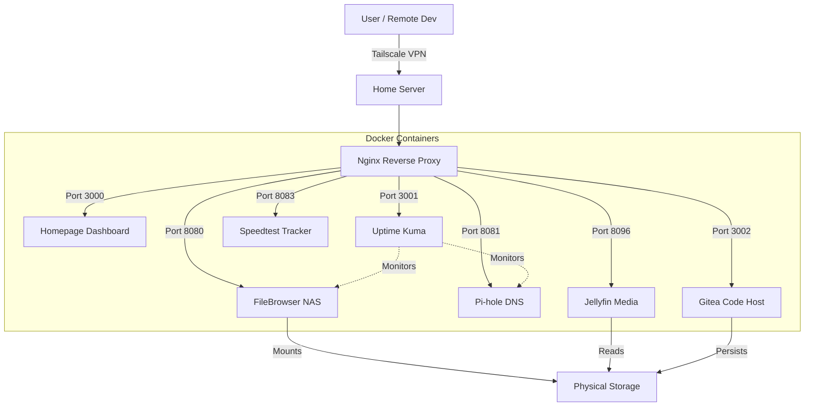

# 🏠 My HomeLab Setup

- A centralized, Docker-based infrastructure for managing my NAS, services, and monitoring.


> A centralized, production-grade homelab environment orchestrated with Docker Compose. This repository manages my NAS file systems, DNS ad-blocking, media streaming, code hosting, and service monitoring, all secured behind a private Tailscale mesh network.

---

## ✨ Features & Services

This stack replaces multiple paid subscriptions with self-hosted open-source alternatives:

| Service               | Type                | Description                                                                                                                                                                           |
| :-------------------- | :------------------ | :------------------------------------------------------------------------------------------------------------------------------------------------------------------------------------ |
| **Homepage**          | 🖥️ Dashboard        | A modern, fully static dashboard. It integrates with Docker to show real-time CPU/RAM usage, disk space (C:/D: drives), and the "Up/Down" status of all containers.                   |
| **FileBrowser**       | 📂 NAS Storage      | Turns the server into a full NAS (Network Attached Storage). Allows for web-based file management, uploading, and downloading of files from the physical hard drives via any browser. |
| **Jellyfin**          | 🍿 Media Server     | The open-source alternative to Netflix/Plex. Streams movies and TV shows from the local `D:/Media` storage to tablets, phones, and smart TVs with metadata scraping.                  |
| **Gitea**             | 🐙 Code Hosting     | A self-hosted Git service (similar to GitHub). Provides private repositories for version control, project management, and storing CI/CD workflows.                                    |
| **Pi-hole**           | 🛡️ Network Security | A DNS sinkhole that blocks ads, trackers, and malicious domains across the entire network before they reach client devices.                                                           |
| **Speedtest Tracker** | 📉 Network Monitor  | Automatically runs internet speed tests every hour. Logs historical data (Ping, Upload, Download) to monitor ISP consistency and uptime.                                              |
| **Uptime Kuma**       | 💓 Health Checks    | Monitors the heartbeat of all services. Sends alerts if a service goes down or if the Tailscale tunnel disconnects.                                                                   |

---

## 🏗️ Architecture & Stack

This setup runs on a **"Service-First"** architecture where every component is containerized and configuration is decoupled from the application logic.



## 🚀 Getting Started

- This repository follows **_infrastructure as code(Iac)_** principles. Secrets are managed via environment variables and configuration are mounted dynamicaly

### Prerequisites

- Docker engine & Docker compose
- Tailscale(Optional,but recommended for remote access)

### 1. Clone the Repo

```bash
git clone [https://github.com/kimzam30/my-homelab-setup.git](https://github.com/kimzam30/my-homelab-setup.git)
cd my-homelab-setup
```

### 2.Configure Environment Duplicate the example file and fill in your secrets:

```
    cp .env.example .env
```

Open .env and configure the following:

```
# System user ID
    PUID=1000
    PGID=1000

# Path to your hard drives or NAS
    NAS_ROOT=/path/to/your/disk

# Security
    PIHOLE=PASSWORD=yoursecurepassword
```

### 3. Deploy

```
    docker-compose up -d
```

## 📂 Configuration

    Homepage: configs located in config/homepage/
    Nginx: rules located in config/nginx/nginx.conf
    FileBrowser: settings in config/filebrowser/

```
my-homelab-setup/
├── config/
│   ├── homepage/        # Dashboard layout (services.yaml, widgets.yaml)
│   ├── filebrowser/     # NAS settings and local DB
│   ├── nginx/           # Proxy routing rules
│   ├── pihole/          # DNS lists and adblock configs
│   ├── jellyfin/        # Media server user configs
│   └── gitea/           # Git server configs
├── .env.example         # Template for secret variables
├── .gitignore           # Security rules (prevents leaking secrets & data)
└── docker-compose.yaml  # The master stack definition
```

## 🔒 Security & Privacy

- This repository uses "dummy" config files. Sensitive data (databases, .env files) are gitignored.
- **Zero-Trust Access:** Services are not exposed to the public internet.Access is restricted to the local network or via **Tailscale tunnels**.
- **Secret Management:** Sensitive data (password,API keys) are excluded from version control using `.gitignore` and `.env` files.
- **Non-Root Execution:** Containers run with specific PUID/PGID to prevent privilege escalation issues on the host system

## 🤝Contributing

This is a personal homelab configuration, but suggestions are welcome!

1. Fork the project
2. Create your Feature Branch (` git checkout -b feature/AmazingFeature`)
3. Commit your changes (` git commit -m "Add some AmazingFeature"`)
4. Push to the branch (` git push origin feature/AmazingFeature`)

#

built by kimzam.
