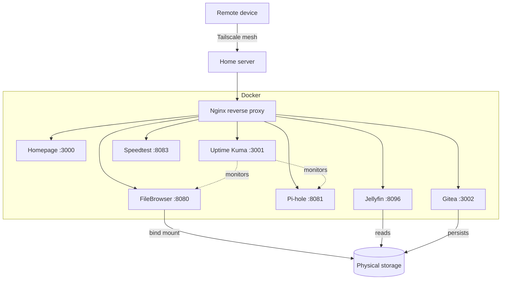

# My Homelab Setup

Self-hosted homelab stack — dashboard, NAS, DNS ad-blocking, media streaming, Git hosting, and uptime monitoring — defined as code with Docker Compose and reachable from anywhere over a private Tailscale mesh.


---

## Services

| Service | Role | Port | What it does |
|---|---|---|---|
| **Homepage** | Dashboard | `3000` | Static dashboard wired to the Docker socket for live container status, CPU/RAM, and disk usage. |
| **FileBrowser** | NAS | `8080` | Web file manager over the host's physical drives — browse, upload, and download from any device. |
| **Nginx** | Reverse proxy | `80` | Single entry point routing to each service. |
| **Uptime Kuma** | Monitoring | `3001` | Heartbeat checks and alerting when a service or the tunnel drops. |
| **Pi-hole** | DNS / ad-blocking | `53`, `8081` | Network-wide DNS sinkhole for ads, trackers, and malicious domains. |
| **Gitea** | Git hosting | `3002`, `2222` | Private Git remotes for work that shouldn't live on GitHub. |
| **Speedtest Tracker** | Network monitor | `8083` | Hourly speed tests logged over time to spot ISP degradation. |
| **Jellyfin** | Media server | `8096` | Streams media from local storage with metadata scraping. |

---

## Architecture


```mermaid
graph TD
    User[Remote device] -->|Tailscale mesh| Host[Home server]
    Host --> Nginx[Nginx reverse proxy]

    subgraph Docker
        Nginx --> Homepage[Homepage :3000]
        Nginx --> FB[FileBrowser :8080]
        Nginx --> UK[Uptime Kuma :3001]
        Nginx --> Pihole[Pi-hole :8081]
        Nginx --> Jellyfin[Jellyfin :8096]
        Nginx --> Speedtest[Speedtest :8083]
        Nginx --> Gitea[Gitea :3002]
    end

    UK -.->|monitors| Pihole
    UK -.->|monitors| FB
    FB -->|bind mount| HDD[(Physical storage)]
    Jellyfin -->|reads| HDD
    Gitea -->|persists| HDD
```

Configuration is decoupled from the containers: every service reads its config from a bind-mounted directory under `config/`, and all secrets come from `.env`, which is gitignored.

---

## Setup

### Prerequisites

- Docker Engine and Docker Compose v2
- Tailscale (optional, but the intended way to reach the stack remotely)

### 1. Clone

```bash
git clone https://github.com/kimzam30/my-homelab-setup.git
cd my-homelab-setup
```

### 2. Configure

```bash
cp .env.example .env
```

Fill in `.env`:

```ini
# Host user — run `id` to find yours
PUID=1000
PGID=1000

# Root of the storage you want FileBrowser to serve
NAS_ROOT=/path/to/your/disk

# Pi-hole admin password
PIHOLE_PASSWORD=change-me

# Media library root for Jellyfin
MEDIA_ROOT=/path/to/your/media

# Speedtest Tracker config directory
SPEEDTEST_CONFIG=/path/to/speedtest/config

# Laravel app key for Speedtest Tracker — generate a real one, do not reuse the example
SPEEDTEST_APP_KEY=base64:...
```

### 3. Deploy

```bash
docker compose up -d
```

Check everything came up:

```bash
docker compose ps
```

---

## Layout

```
my-homelab-setup/
├── config/
│   ├── homepage/        # Dashboard layout (services.yaml, widgets.yaml)
│   ├── filebrowser/     # NAS settings and local DB
│   ├── nginx/           # Proxy routing rules
│   ├── pihole/          # DNS lists and adblock config
│   ├── jellyfin/        # Media server config
│   └── gitea/           # Git server config
├── .env.example         # Template for secrets and host paths
├── .gitignore           # Keeps secrets and service data out of git
└── docker-compose.yaml  # Stack definition
```

---

## Security model

- **No public exposure.** Nothing is port-forwarded. Access is local-network or Tailscale only.
- **Secrets stay out of git.** Passwords and keys live in `.env`; service databases and state directories are gitignored.
- **Non-root containers.** Services run under an explicit `PUID`/`PGID` rather than as root on the host.
- **Committed configs are templates.** Anything checked in is a sanitised example, not a live config.

---

## License

MIT — see [LICENSE](LICENSE).
